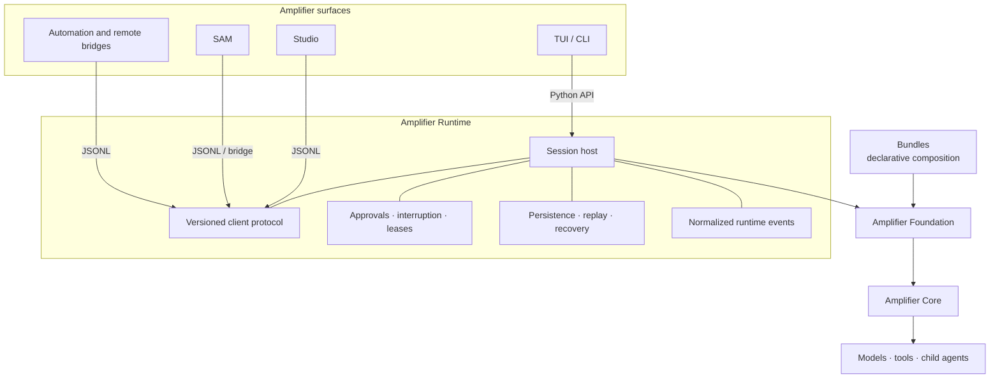
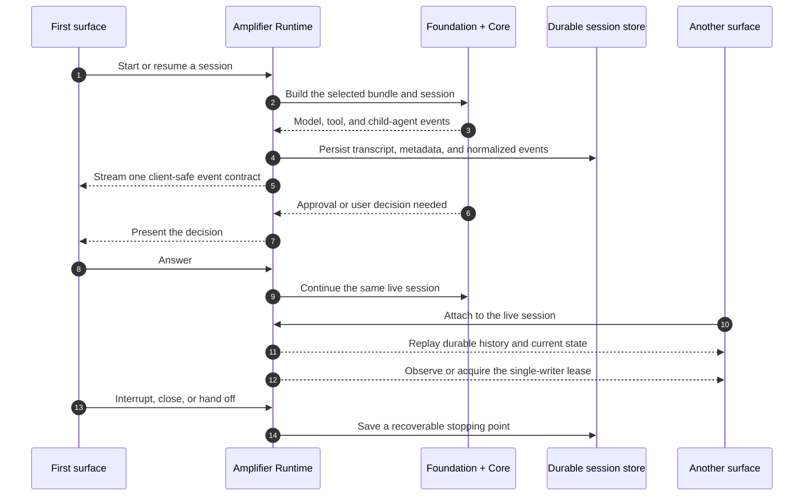

# Amplifier Runtime

**One session engine for every Amplifier surface.**

[](https://github.com/michaeljabbour/amplifier-runtime/actions/workflows/ci.yml)
[](https://github.com/michaeljabbour/amplifier-runtime/releases)
[](https://www.python.org/)
[](LICENSE)

Amplifier Runtime is the UI-neutral session engine shared by
[Amplifier](https://github.com/microsoft/amplifier) clients. It lets Studio,
SAM, terminal apps, automation, and future surfaces share the same agents,
approvals, plans, history, and recovery behavior instead of rebuilding those
capabilities in every app.

It is a Python package and executable over Amplifier's hybrid Python/Rust Core.
It is **not** a UI and **not** an Amplifier bundle.

## Why it exists

An Amplifier session is more than a model call. It has a durable identity,
mounted bundles, child agents, tool activity, approvals, interruptions,
replayable history, and rules about who may write to it.

Before Amplifier Runtime, each client could end up owning a slightly different
version of that machinery. Runtime centralizes it so a session behaves the same
way no matter where it is surfaced.



A client can host Runtime in-process, launch it as a local subprocess, or launch
it on another machine and carry the JSONL stream through its own authenticated
bridge. The session contract stays the same; the client still owns how that
session looks and feels.

## What belongs where

| Layer | Owns | Does not own |
| --- | --- | --- |
| **Bundles** | Agents, behaviors, tools, providers, context, declarative composition | Process hosting, persistence, UI |
| **Amplifier Runtime** | Session creation, normalized events, persistence, replay, approvals, interruption, attach, handoff, and writer leases | Rendering, native pickers, app chrome, product updates |
| **Clients** | Conversation design, terminal or desktop presentation, native input, notifications, and product-specific controls | A second implementation of Amplifier session behavior |

This boundary is deliberate: Foundation composes the session, Core runs it,
Runtime keeps it durable and controllable, and each client presents it in the
form best suited to its users.

## One session, through its full life



The important detail is that attaching another client does not create another
runtime. Both surfaces join the same live owner, and the lease decides who may
write.

## Runtime guarantees

- **Durable by default.** Transcripts and metadata are written atomically, with
  recovery paths for interrupted writes.
- **One normalized event stream.** Core and hook events are translated once,
  then used for both live updates and later replay.
- **One writer.** A lease prevents two clients or processes from independently
  driving the same session.
- **Honest recovery.** Resume, attach, replay, and handoff are distinct actions;
  Runtime does not pretend a damaged or unavailable session is healthy.
- **Client neutrality.** Runtime never imports Textual, prompt-toolkit, Tauri,
  SolidJS, or client rendering code.
- **Redacted boundaries.** Secrets are kept out of durable client records and
  configuration output.

## Install

### macOS and Linux

```sh
curl --proto '=https' --tlsv1.2 -fsSL \
  https://raw.githubusercontent.com/michaeljabbour/amplifier-runtime/main/scripts/install.sh \
  | sh
```

### Windows PowerShell

```powershell
$script = Invoke-RestMethod -UseBasicParsing \
  'https://raw.githubusercontent.com/michaeljabbour/amplifier-runtime/main/scripts/install.ps1'
& ([scriptblock]::Create($script))
```

Both installers resolve `main` to a full commit before installation and verify
the executable, JSONL host, and provider-status contract. Install a reviewed
revision directly with `--ref <40-character-sha>` on macOS/Linux or
`-Ref <sha>` on Windows.

Verify the result:

```sh
amplifier-runtime --version
amplifier-runtime serve --help
```

## Client contract

`serve` is a bidirectional, schema-versioned JSONL protocol over standard input
and output. Clients request replay after resume or attachment and preserve the
single-writer lease by attaching to a live owner instead of starting a second
host for the same durable session.

```sh
amplifier-runtime serve --attachable
amplifier-runtime serve --resume <session-id>
amplifier-runtime serve --attach <session-id>

amplifier-runtime provider status --format json
amplifier-runtime provider add openai --api-key-stdin --yes
amplifier-runtime settings get behavior
amplifier-runtime config paths --json
```

| Integration | Best for | Contract |
| --- | --- | --- |
| **In-process Python API** | TUI and CLI clients | Direct access to the same runtime implementation |
| **JSONL subprocess** | Desktop apps such as Studio | Versioned operations in, normalized events out |
| **Remote bridge** | SAM, automation, and non-local compute | The same JSONL stream carried by a client-owned secure transport |
| **Live attach** | A second local surface joining an active session | Replay plus observer/writer lease semantics |

Live attach uses a local Unix-domain endpoint on macOS and Linux. Windows
currently falls back to durable resume rather than claiming a live attach it
cannot provide.

## Bundles remain composition

Runtime never silently chooses a client-specific bundle. The active bundle and
its overlays remain declarative inputs selected by the client or durable
settings.

That keeps the architecture clean:

```text
bundle = what the Amplifier session contains
runtime = how the session lives and continues
client = how the session is experienced
```

## Development

```sh
uv sync --frozen
uv run ruff check .
uv run ruff format --check .
uv run pyright src tests
uv run pytest -q
uv build
```

Protocol changes require schema and fixture coverage plus compatibility testing
through the real TUI and Studio adapters. Focused unit tests are useful while
iterating, but they are not enough to claim client compatibility.

## Project status

Amplifier Runtime is an active `0.1.x` component. It is already the shared
session implementation for Amplifier clients, while its public protocol and
remote-hosting surfaces continue to mature.

- [Releases](https://github.com/michaeljabbour/amplifier-runtime/releases)
- [Issues](https://github.com/michaeljabbour/amplifier-runtime/issues)
- [Amplifier](https://github.com/microsoft/amplifier)

Licensed under the [MIT License](LICENSE).
