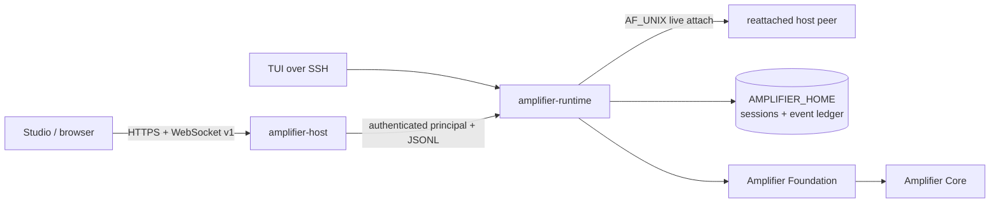

# Amplifier Runtime

`amplifier-runtime` is the UI-neutral session host shared by Amplifier's
terminal and desktop clients. It builds sessions through Amplifier Foundation,
drives Amplifier Core, normalizes runtime events, and owns durable session
identity, persistence, replay, approvals, interruption, and writer leases.

It is a Python package and executable, not an Amplifier bundle. Bundles remain
the declarative composition selected by a client or durable settings.

```text
TUI / CLI -- in-process API --\
                              amplifier-runtime -> Foundation -> Core
Studio ---- JSONL protocol ---/
```

For remote work, a separate Rust application authenticates the network peer
and supervises this process. Runtime itself deliberately opens no TCP port and
contains no Tauri, browser, TLS, token-issuance, or project-allowlist policy.



The separation is intentional: Runtime owns session mechanism; the host app
owns network and machine policy. A client disconnect changes neither the
model loop nor the durable store. A detached owner survives its launch pipe,
advertises a pid-and-socket endpoint, and can be re-adopted after the host app
restarts without creating a second writer.

## Install

macOS or Linux:

```sh
curl --proto '=https' --tlsv1.2 -fsSL \
  https://raw.githubusercontent.com/michaeljabbour/amplifier-runtime/main/scripts/install.sh \
  | sh
```

Windows PowerShell:

```powershell
$script = Invoke-RestMethod -UseBasicParsing \
  'https://raw.githubusercontent.com/michaeljabbour/amplifier-runtime/main/scripts/install.ps1'
& ([scriptblock]::Create($script))
```

Both installers resolve `main` to a full commit before installation and verify
the executable, JSONL host, and provider-status contract. To install a reviewed
revision directly, pass `--ref <40-character-sha>` or `-Ref <sha>`.

## Client contract

```sh
amplifier-runtime serve --attachable
amplifier-runtime serve --attachable --detached --project-dir /srv/project
amplifier-runtime provider status --format json
amplifier-runtime provider add openai --api-key-stdin --yes
amplifier-runtime settings get behavior
amplifier-runtime config paths --json
amplifier-runtime bundle warm foundation
```

`serve` is a bidirectional, schema-versioned JSONL protocol on stdio. Clients
must request history replay after resume or attachment and must preserve the
single-writer lease: attach to a live owner rather than starting a second host
for the same durable session.

The first operation across a remote boundary is `runtime.capabilities`. It
returns the supported protocol range, the audited operation registry, required
read/write/control permission for every operation, and feature identifiers.
Current remote-safe primitives include:

- Cursor-based `history.replay` and live `serve --attach SESSION_ID`
- Chunked, project-contained `artifact.read` with SHA-256 identity
- Redacted `settings.schema` and `settings.get`
- Bounded `settings.apply`; changes affect the next prepared session, never
  silently mutate a session already running
- Lease acquire/heartbeat/release/takeover and attributed write auditing

The authenticating host maps its transport claim into Runtime's
`session_authz.StaticPolicy`. The network layer does not invent a second
approval or lease model, and provider credentials remain host-side.

## Durability and remote compute

`AMPLIFIER_HOME` relocates the durability unit: settings, keys, project
registries, sessions, replay ledgers, attach endpoints, and audit state. On an
ephemeral VM or pod, point it at storage that outlives the instance. An
ephemeral Amplifier home honestly means ephemeral sessions.

The supported v1 lifecycle is:

1. The host launches `serve --attachable --detached --project-dir …` with an
   authenticated principal.
2. Runtime advertises `attach.json` plus an AF_UNIX socket beside the session
   (or in a bounded temporary path when the project path is too long).
3. Client sockets may detach and reconnect; the owner continues.
4. If the host daemon restarts, it joins the same live endpoint. The pid and
   socket are both probed, so stale endpoints cannot create a false owner.
5. If no live owner exists, stored resume is the recovery floor.

Hosts currently target Linux, macOS, and WSL2, where AF_UNIX is available.
Network exposure is the responsibility of `amplifier-host` behind Tailscale
Serve, an SSH tunnel, or an authenticated TLS reverse proxy.

## Migration state

The implementation is being extracted from `amplifier-app-tui` without a
rewrite. The TUI uses this package as its exclusive kernel/model import path;
its formerly local copies are non-executable compatibility history. Studio
launches this executable directly. Client-specific rendering remains in each
client repository.

## Development

```sh
uv sync
uv run ruff check .
uv run pyright src tests
uv run pytest -q
uv run amplifier-runtime --version
uv run amplifier-runtime serve --help
```

The runtime never imports Textual, prompt-toolkit, Tauri, SolidJS, or client
rendering code. Protocol changes require schema/fixture tests and compatibility
validation through the TUI and Studio adapters.
